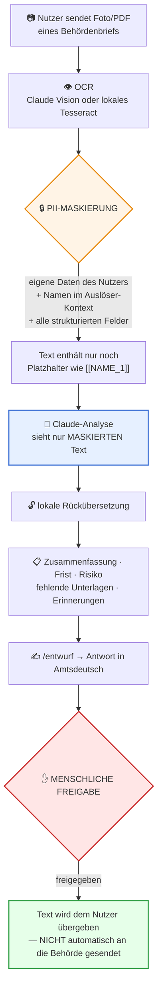
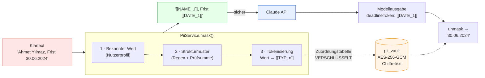
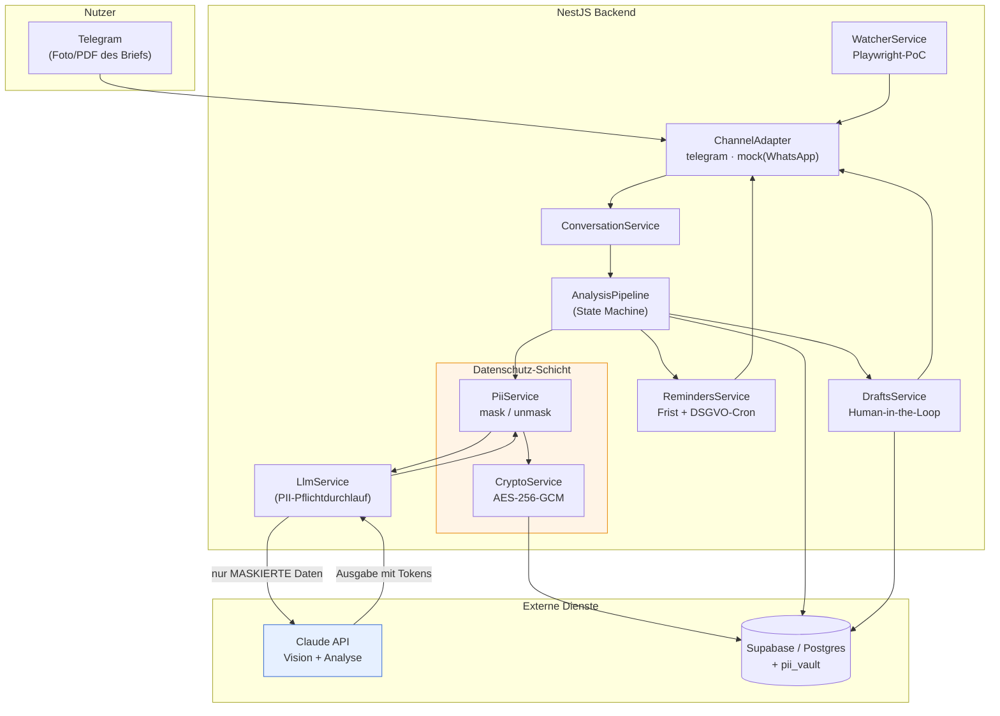

<div align="center">

# 🇩🇪 BüKo — Assistent für Behördenbriefe

**Ein Telegram-Assistent für alle, die in Deutschland Behördenpost bekommen und nicht sofort verstehen, was verlangt wird.**

[](https://github.com/burakerdgn1/B-Ko/actions/workflows/ci.yml)
[](DECISIONS.md)
[](tsconfig.json)
[](LICENSE)
[](DECISIONS.md)

[Das Problem](#das-problem) · [Ablauf](#ablauf) · [PII-Maskierung](#kernfunktion-pii-maskierung) · [Architektur](#architektur) · [Demo](#demo) · [Schnellstart](#schnellstart)

</div>

---

**BüKo bietet keine Rechtsberatung.** Es dient der Information und Vorbereitung;
bei verbindlichen Fragen wenden Sie sich an eine Anwältin/einen Anwalt oder die
zuständige Behörde.

## Das Problem

Ein Brief der Ausländerbehörde wirft für alle, die kein Amtsdeutsch gewohnt sind,
drei Fragen auf: **Was wird verlangt?**, **Bis wann?**, **Welche Unterlagen
brauche ich?** Eine verpasste Frist kann dazu führen, dass ein Aufenthaltstitel
nicht verlängert wird.

BüKo beantwortet diese drei Fragen — und sorgt dafür, dass **Ihre persönlichen
Daten** dabei nicht ungeschützt an eine KI gehen. Was das konkret bedeutet, ist
unten **gemessen**, nicht nur behauptet.

## Ablauf



Ausführlichere Ablaufdiagramme (Sequenzdiagramm, Freigabe-State-Machine, Datenmodell): [`docs/architecture-diagram.md`](docs/architecture-diagram.md)

---

## Kernfunktion: PII-Maskierung

Das ist keine nachträglich angebaute "Datenschutzfunktion" — es ist der Kern der Architektur.



**Wie:** Persönliche Angaben im Brief werden vor dem Versand an die KI in
deterministische Platzhalter verwandelt. Das Modell sieht `[[STEUERID_1]]`,
niemals die echte Nummer. Bei der Antwort wird lokal zurückübersetzt. Die
Zuordnungstabelle wird **AES-256-GCM-verschlüsselt** gespeichert — für jeden
maskierten Wert existiert die Klardaten-Version ausschließlich im
verschlüsselten Vault.

**Was abgedeckt ist (gemessen, keine Behauptung):**

Beim Onboarding gibt der Nutzer einmalig seinen eigenen Namen und seine Adresse
an. Diese Angaben werden **AES-256-GCM-verschlüsselt** in `pii_vault`
gespeichert (nie im Klartext, nie an die KI gesendet) und ermöglichen danach in
jedem Brief die "Bekannte-Werte-Maskierung".

| Feld | Status |
|---|---|
| Steuer-ID, IBAN, E-Mail, Telefon, Datum, Aktenzeichen, Ausländernummer, Reisepass, Versicherungsnummer | ✅ Immer maskiert (Strukturmuster + Prüfsumme) |
| Adresse — Standard-Format (`…straße 12`, `10827 Berlin`) | ✅ Immer maskiert |
| **Eigener Name und Adresse des Nutzers** | ✅ Nach Onboarding maskiert |
| Adresse des Nutzers — untypisches Format | ✅ Nach Onboarding (exakter Abgleich) |
| **Namen Dritter** — im Auslöser-Kontext (Sachbearbeiter:in, Familienangehörige, Anwält:in) | ✅ Maskiert |

<details>
<summary><strong>Wie funktionieren die kontextuellen Auslöser für Namen Dritter?</strong></summary>

Die *Form* eines Namens macht ihn nicht erkennbar — aber in deutscher
Amtskorrespondenz sind die **Kontexte**, in denen Namen auftauchen, sehr
regelmäßig. BüKo erkennt diese Kontexte deterministisch:

`Sehr geehrte(r) Herr/Frau X` · `Ihre Sachbearbeiterin: Frau X` ·
`Ansprechpartner: X` · `Herrn X` (Adressblock) · `i. A. X` / `gez. X`
(Unterschrift) · `Ihrer Ehefrau X` · `Rechtsanwältin X`

Das funktioniert ohne probabilistisches Modell — dadurch bleibt es
**nachvollziehbar und reproduzierbar**, ein Grundprinzip der Architektur.

**Schutz vor Falsch-Positiven.** Im Deutschen beginnt *jedes* Substantiv groß —
"Großbuchstabe = Eigenname" wäre also eine katastrophale Heuristik. BüKo nutzt
das nie als Signal: Es greift ausschließlich in Auslöser-Kontexten und wendet
zusätzlich eine Stoppliste an (`Damen`, `Herren`, `Behörde`, `Abteilung` …).
Messung: In 8 synthetischen Briefen waren **16 von 16 NAME-Treffern** echte
Namen — null Falsch-Positive.

Aktuelle Forschung: Ein lokal laufendes NER-Modell (ohne Netzwerkzugriff) für
Namen *ohne* Auslöser-Kontext wurde evaluiert — 100 % Recall, 0
Falsch-Positive auf dem Testkorpus (`npm run bench:ner-mask`). Integration
wird vorbereitet.

</details>

<details>
<summary><strong>Beweis — nicht nur behauptet, sondern getestet</strong></summary>

- `unmask(mask(x)) === x` — verlustfreier Round-Trip
- Automatisiert geprüft: Im maskierten Text bleibt kein Originalwert als Teilstring erhalten
- Bei 8 realistischen Behördenbriefen wird das an die API gesendete **Payload
  geprüft** — nachweislich keine Klardaten enthalten (`llm.leak-guard.spec.ts`)
- Schlägt die Maskierung fehl, wird der API-Aufruf **gar nicht erst
  ausgeführt** (fail-closed)
- **Lecks werden nicht nur im Payload geprüft, sondern in ALLEN Kanälen**:
  Log-Zeilen, in die DB geschriebene Fehlermeldungen, Exceptions/Stacktraces
  und Audit-Einträge (`leak-channels.spec.ts`)
- Der Vault wird VOR dem maskierten Text geschrieben → keine "verwaisten"
  Dokumente, die nicht mehr entschlüsselt werden können; nebenläufige Analysen
  und Nutzerisolation sind getestet (`pipeline.concurrency.spec.ts`)

</details>

---

## Sicherheitsregeln (auf Code-Ebene erzwungen)

| Regel | Wie sie durchgesetzt wird |
|---|---|
| **Nichts wird im Namen des Nutzers an eine Behörde gesendet** | Im Code existiert kein Kanal zur Behörde. Die Freigabe übergibt ausschließlich Text an den Nutzer; die Nachricht sagt das explizit. |
| **Ohne Freigabe kein "gesendet"** | Dreifache Absicherung: Anwendungsservice + Repository + Postgres-Trigger. Eine Freigabe muss eine vorher abgeschlossene, separate menschliche Handlung sein. |
| **Ohne Einwilligung keine Verarbeitung** | Ohne Einwilligung gesendete Dokumente oder `/profil`-Aufrufe erzeugen null Datensätze (getestet). |
| **PII wird nicht geloggt** | Die Leck-Prüfung loggt ausschließlich *Typen*. Fehlermeldungen werden klassifiziert; die Rohtext-Ebene wird nicht mitgeschrieben. |
| **Datenminimierung** | Jeder Datensatz hat `delete_after`; täglicher Löschcron + `/loeschen`-Befehl des Nutzers — per `ON DELETE CASCADE` werden auf DB-Ebene alle verknüpften Datensätze (Analyse, Entwurf, PII-Vault) gemeinsam gelöscht. |
| **KI wird offengelegt** | Bei jedem `/start`. |

---

## Architektur



**Technologieauswahl:**


Standardmodell `claude-sonnet-5` (Analyse, Vision-fähig) — per `.env` änderbar.
Ausführlicheres Sequenzdiagramm, Freigabe-State-Machine und
ER-Datenmodell: [`docs/architecture-diagram.md`](docs/architecture-diagram.md).

---

## Demo

Unter `test-fixtures/behordenbriefe/` liegen 14 synthetische Behördenbriefe
(keine echten Personendaten). Der folgende Ablauf ist in Produktion
Ende-zu-Ende verifiziert:

```
Nutzer:  /start
BüKo:    🤖 Hallo! Ich bin BüKo, ein KI-Assistent — ich bin KEIN Mensch,
         Beamter oder Anwalt.
         ⚠️ Meine Angaben sind KEINE Rechtsberatung.
BüKo:    Bevor wir starten: Für die Analyse muss ich Ihre Daten verarbeiten.
         Sind Sie einverstanden? (/zustimmen)

Nutzer:  /zustimmen
BüKo:    Ein letzter Schritt: Damit ich IHRE eigenen Angaben (Name, Adresse)
         in Briefen unkenntlich machen kann, bevor etwas an die KI geht,
         muss ich sie einmal kennen. Diese Angaben werden verschlüsselt
         gespeichert und NIE an die KI gesendet. (Mit /ueberspringen
         auslassbar)
BüKo:    1/3 — Ihr Vor- und Nachname?
Nutzer:  Yasin Kılıç
BüKo:    2/3 — Ihre Adresse?
Nutzer:  Kolonnenstraße 12
BüKo:    3/3 — PLZ und Ort?
Nutzer:  10827 Berlin
BüKo:    ✅ Danke. Diese Angaben werden künftig maskiert, bevor etwas an
         die KI geht.

Nutzer:  [Foto des Ausländerbehörde-Briefs]

BüKo:    🟠 Ausländerbehörde Berlin

         Für Ihren Antrag auf Verlängerung der Aufenthaltserlaubnis werden
         zusätzliche Unterlagen benötigt.

         📅 30.06.2024 — noch 29 Tage

         📎 Fehlende/angeforderte Unterlagen:
         • Aktueller Mietvertrag
         • Nachweis über Krankenversicherung
         • Aktuelle Gehaltsabrechnungen (letzte 3 Monate)

         ✅ Empfohlene Schritte:
         1. Unterlagen zusammenstellen
         2. Vor Fristablauf antworten

         Auf Wunsch erstelle ich einen Antwortentwurf: /entwurf
         ⚖️ BüKo bietet keine Rechtsberatung.

Nutzer:  /entwurf
BüKo:    [Entwurf in Amtsdeutsch]  [✅ Freigeben]  [❌ Ablehnen]

Nutzer:  ✅ Freigeben
BüKo:    Sie können den Text kopieren und selbst an die Behörde senden.
         BüKo versendet nichts in Ihrem Namen.
```

Bei nahender Frist werden automatisch Erinnerungen (14/7/3/1 Tage vorher)
gesendet.

---

## Status

**665 Tests bestehen** (46 Suiten) · TypeScript strict · läuft ohne echten
API-Schlüssel Ende-zu-Ende (Mock-Modi).

| Bereich | Status |
|---|---|
| Datenmodell, PII-Maskierung, Config, Crypto | ✅ |
| Persistenz (Memory + Supabase), LLM-Wrapper, Kanaladapter | ✅ |
| Analyse-Pipeline (Zusammenfassung/Frist/Risiko/fehlende Unterlagen) | ✅ |
| Entwurfserstellung + menschliche Freigabe | ✅ |
| Erinnerungen + DSGVO-Löschcron | ✅ |
| Terminüberwachung (Playwright-PoC) | ✅ |
| Telegram-Chatablauf (tr/de/en) | ✅ |
| Telegram-Webhook (mit Secret-Verifizierung) | ✅ |
| Onboarding-Profil (Bekannte-Werte-Maskierung) | ✅ |
| Namen Dritter — kontextuelle Auslöser | ✅ |
| Deployment (Docker + Railway, `/health`) | ✅ live im Einsatz |

---

## Schnellstart

```bash
git clone https://github.com/burakerdgn1/B-Ko.git && cd B-Ko
npm install
cp .env.example .env      # läuft ohne Schlüssel: LLM_MOCK=true, DB_DRIVER=memory
npm test                  # 665 Tests
npm run start:dev
```

Für den Betrieb mit echten Schlüsseln: [`MANUAL_ACTIONS_REQUIRED.md`](MANUAL_ACTIONS_REQUIRED.md)
Deployment: [`docs/DEPLOYMENT.md`](docs/DEPLOYMENT.md)

### Betriebsbefehle

| Befehl | Was er macht |
|---|---|
| `npm run check:deploy` | Go/No-Go vor dem Deployment — prüft `validateEnv()`, `PUBLIC_BASE_URL`, Webhook-Secret, Supabase, Anthropic. Verursacht keine Kosten. |
| `npm run check:supabase` | Verbindung + Schlüsseltyp + Schema-Diagnose (nur lesend). |
| `npm run check:docs-sync` | Prüft, ob Test-/Entscheidungszahl in README mit der Realität übereinstimmt. |
| `npm run test:supabase` | Integrationstests gegen echtes Postgres (16). |
| `npm run bench:ner-mask` | Lokale NER-Messung für Namenserkennung ohne Auslöser-Kontext. |
| `npm run rotate:supabase-key` | Rotation des Supabase-Secret-Keys — fail-safe, standardmäßig Trockenlauf. |
| `npm run rotate:pii-key` | Rotation des PII-Vault-Schlüssels ohne Datenverlust. |

Health-Check: `GET /health` → `{"status":"ok","uptime":N}`.

---

## Projektdokumentation

| Datei | Inhalt |
|---|---|
| [`ARCHITECTURE.md`](ARCHITECTURE.md) | Architektur, Modulübersicht, Datenmodell |
| [`docs/architecture-diagram.md`](docs/architecture-diagram.md) | Alle Mermaid-Diagramme (Sequenz, State Machine, ER-Diagramm) |
| [`DECISIONS.md`](DECISIONS.md) | Jede Architekturentscheidung mit Begründung (58 Entscheidungen) |
| [`STATUS.md`](STATUS.md) | Aktueller Stand |
| [`PROGRESS.md`](PROGRESS.md) | Chronologischer Verlauf |

## Lizenz

MIT — siehe [`LICENSE`](LICENSE).
