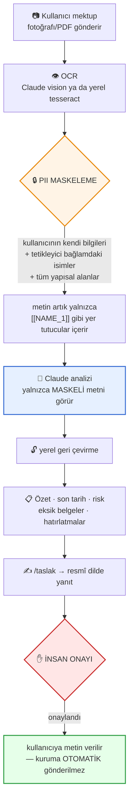
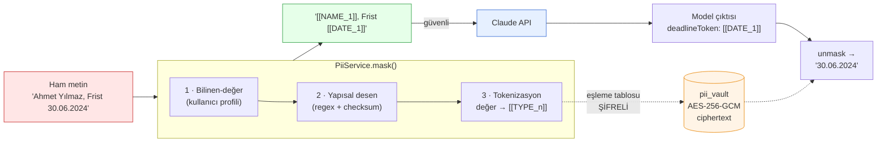
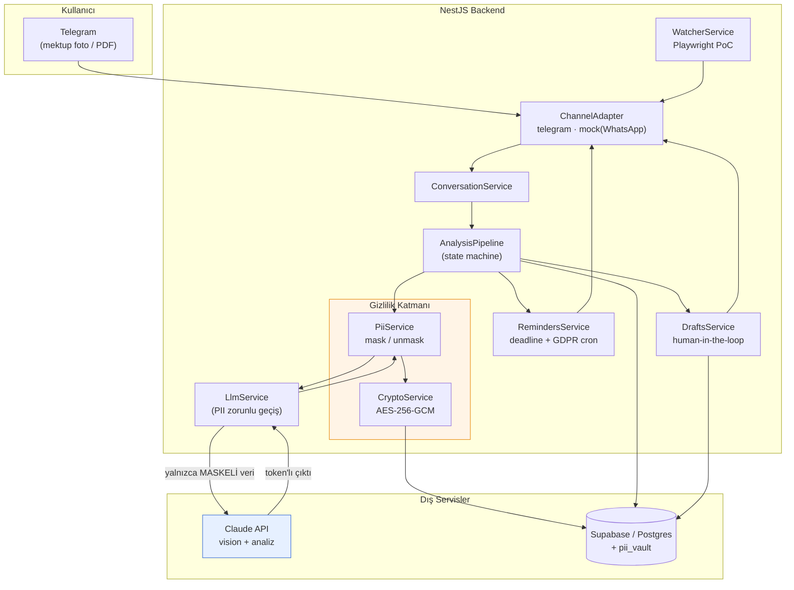

<div align="center">

# 🇩🇪 BüKo — AI Bureaucracy Copilot

**Almanya'daki göçmenlerin resmî kurum yazışmalarını anlamasına ve zamanında yanıtlamasına yardımcı olan bir Telegram asistanı.**

[](https://github.com/burakerdgn1/B-Ko/actions/workflows/ci.yml)
[](DECISIONS.md)
[](tsconfig.json)
[](LICENSE)
[](DECISIONS.md)

[Sorun](#sorun) · [Nasıl çalışır](#nasıl-çalışır) · [PII maskeleme](#ayırt-edici-özellik-pii-maskeleme-katmanı) · [Mimari](#mimari) · [Demo](#demo) · [Hızlı başlangıç](#hızlı-başlangıç)

</div>

---

**BüKo hukuki tavsiye vermez.** Bilgilendirme ve hazırlık asistanıdır; bağlayıcı
konularda bir avukata veya ilgili kuruma danışın.

## Sorun

Ausländerbehörde'den gelen bir mektup, Almanca bilmeyen biri için üç ayrı problem üretir:
**ne isteniyor**, **son tarih ne zaman**, **hangi belgeleri hazırlamalıyım**.
Kaçırılan bir Frist, oturum izninin uzatılmamasına kadar gidebilir.

BüKo bu üç soruyu yanıtlar ve **sizin kimlik bilgilerinizin** yapay zekâya
gitmesini engeller — neyin kapsandığı aşağıda **ölçülmüş** olarak listelidir.

## Nasıl çalışır



Daha ayrıntılı akış diyagramları (sıra diyagramı, onay state machine'i, veri modeli): [`docs/architecture-diagram.md`](docs/architecture-diagram.md)

---

## Ayırt edici özellik: PII maskeleme katmanı

Bu, sonradan eklenmiş bir "gizlilik özelliği" değil; mimarinin merkezinde.



**Nasıl:** Belgedeki kimlik bilgileri LLM'e gitmeden önce deterministik yer
tutuculara çevrilir. Model `[[STEUERID_1]]` görür, gerçek numarayı değil. Yanıt
geldiğinde yerelde geri çevrilir. Eşleme tablosu **AES-256-GCM ile şifreli**
saklanır. Maskelenen her değer için düz PII yalnızca şifreli vault'ta durur.

**Neyin kapsandığı (ölçülmüş, iddia değil):**

Onboarding'de kullanıcı kendi ad/adres bilgisini bir kez verir. Bu bilgiler
**AES-256-GCM ile şifreli** olarak `pii_vault`'ta saklanır (asla düz metin,
asla yapay zekâya gönderilmez) ve her belgede "bilinen-değer maskeleme"yi besler.

| Alan | Durum |
|---|---|
| Steuer-ID, IBAN, e-posta, telefon, tarih, Aktenzeichen, Ausländernummer, pasaport, sigorta no | ✅ Her zaman maskelenir (yapısal desen + checksum) |
| Adres — standart Alman biçimi (`…straße 12`, `10827 Berlin`) | ✅ Her zaman maskelenir |
| **Kullanıcının kendi adı ve adresi** | ✅ **Onboarding sonrası maskelenir** |
| Kullanıcının adresi — standart dışı biçim | ✅ Onboarding sonrası (birebir eşleşme) |
| **Üçüncü taraf isimleri** — tetikleyici bağlamda (memur, aile üyesi, avukat) | ✅ Maskelenir (D-029) |
| Üçüncü taraf isimleri — **tetikleyicisiz**, cümle içinde çıplak geçen | ⏳ **v2'de ölçüldü — bkz. D-057** |
| Profil vermeyen (`/atla`) kullanıcının adı — tetikleyici bağlamda | ✅ Maskelenir |

<details>
<summary><strong>Üçüncü taraf isimleri: bağlamsal tetikleyiciler nasıl çalışıyor? (D-029)</strong></summary>

Bir ismin *biçimi* onu tanınabilir kılmaz — ama Alman resmî yazışmasında
isimlerin geçtiği **bağlamlar** son derece düzenlidir. BüKo bu bağlamları
deterministik olarak yakalar:

`Sehr geehrte(r) Herr/Frau X` · `Ihre Sachbearbeiterin: Frau X` ·
`Ansprechpartner: X` · `Herrn X` (adres bloğu) · `i. A. X` / `gez. X` (imza) ·
`Ihrer Ehefrau X` · `Rechtsanwältin X`

Bu, olasılıksal bir model olmadan çalışır; dolayısıyla **denetlenebilir ve
tekrarlanabilir** kalır — maskelemenin temel tasarım ilkesi budur (D-003).

**Yanlış pozitif koruması.** Almancada *tüm* isimler büyük harfle başlar, bu
yüzden "büyük harf = özel ad" sezgisi Almanca'da felaket olurdu. BüKo bunu asla
sinyal olarak kullanmaz: yalnızca tetikleyici bağlamlarda eşleşir ve ayrıca bir
stoplist (`Damen`, `Herren`, `Behörde`, `Abteilung` …) uygular.
Ölçüm: 8 sentetik mektupta **16 NAME eşleşmesinin 16'sı da gerçek isim** —
sıfır yanlış pozitif. Test, alan terimlerinin maskelenmediğini ve token
oranının %15'i aşmadığını (aşırı maskeleme yok) sürekli doğrular.

</details>

<details>
<summary><strong>⚠️ v2 sınırı ve ölçülen çözüm yönü: tetikleyicisiz isimler (D-028 / D-057)</strong></summary>

Hiçbir unvan/etiket olmadan cümle içinde geçen isimler v1'de maskelenmiyordu:

> „Der Antrag wurde von **Petra Hoffmann** geprüft."

Burada `von` bir tetikleyici değildir. Bunu küçümsemiyoruz: bu da kişisel veridir.
Yarım bir çözüm eklemedik çünkü yanlış pozitifler mektubu okunamaz hâle getirir,
yanlış negatifler ise sahte güven yaratır — ölçülmüş ve ilan edilmiş bir boşluk,
ölçülmemiş bir modelden dürüsttür (D-028).

**D-057'de bu yön ölçüldü:** `scripts/ner-mask-bench.ts`, tamamen yerelde (ağa
çıkmadan) çalışan bir NER modeliyle (`@huggingface/transformers`, Node içinde
ONNX) bu tam senaryoyu test etti — **%100 recall, sıfır yanlış-pozitif**
(26 örneklik etiketli korpus). Production koduna henüz entegre edilmedi;
gerçek/OCR-bozulmuş mektuplara karşı ikinci bir ölçüm turu bekleniyor
(D-044'ün "ölç ama üretime alma" disipliniyle).

**Son tarih nasıl çıkarılıyor?** Model, takvim değerini değil ilgili
`[[DATE_n]]` yer tutucusunu döndürür — hangi tarihin son tarih olduğunu
bağlamdan seçer. Gerçek tarih yerelde çözülür. Gizlilik ve işlevsellik birlikte korunur.

</details>

<details>
<summary><strong>Kanıt — iddia değil, test edilmiş</strong></summary>

- `unmask(mask(x)) === x` — kayıpsız round-trip
- Maskeli metinde hiçbir orijinal PII substring'i kalmadığı testle doğrulanır
- 8 gerçekçi Behördenbrief üzerinde, API'ye giden **payload denetlenerek**
  ham PII bulunmadığı kanıtlanır (`llm.leak-guard.spec.ts`)
- Maskeleme başarısız olursa çağrı **hiç yapılmaz** (fail-closed)
- **Sızıntı yalnızca payload'da değil, TÜM kanallarda denetlenir**: log satırları,
  DB'ye yazılan hata mesajları, exception/stack trace ve audit kayıtları
  (`leak-channels.spec.ts`)
- Vault, maskeli metinden ÖNCE yazılır → çözülemeyen "yetim" belge kalmaz;
  eşzamanlı analizler ve kullanıcı izolasyonu test edilir (`pipeline.concurrency.spec.ts`)
- Maskelemenin **neyi kaçırdığı** da ölçülür ve sabitlenir (`pii.gap-audit.spec.ts`)

**Dürüst sınırlama:** Fotoğraf gönderildiğinde OCR adımı bir istisnadır. Bir
mektup görseli zorunlu olarak PII içerir; `claude-vision` modunda bu görsel
Anthropic'e ulaşır. Maskeleme, bundan **sonraki** her adımı (analiz, taslak
üretimi, veritabanı, denetim izi) korur. Sıfır sızıntı isteyenler için:
`OCR_PROVIDER=local` (tesseract.js ile yerel OCR) — metin/PDF girdilerinde ham
veri zaten hiç LLM'e gitmez. Ayrıntı: [`DECISIONS.md`](DECISIONS.md) D-010.

</details>

---

## Güvenlik kuralları (kod seviyesinde zorlanır)

| Kural | Nasıl zorlanıyor |
|---|---|
| **Hiçbir şey kullanıcı adına kuruma gönderilmez** | Kodda kuruma giden hiçbir kanal yok. Onay yalnızca metni kullanıcıya verir; mesaj bunu açıkça söyler. |
| **Onay olmadan "gönderildi" olmaz** | Üç katmanda kapı: uygulama servisi + repository + Postgres trigger. Onay, önceden kalıcılaşmış ayrı bir insan eylemi olmalı. |
| **Rıza olmadan belge/profil işlenmez** | Rızasız gönderilen belge veya `/profil` için sıfır kayıt oluşur (test edilir, D-056). |
| **PII loglanmaz** | Sızıntı denetimi yalnızca *tip* loglar. Hata mesajları sınıflandırılır; alt katman metni ham hâliyle yazılmaz. |
| **Veri minimizasyonu** | Her kayıtta `delete_after`; günlük silme cron'u + kullanıcının `/sil` komutu — DB seviyesinde `ON DELETE CASCADE` ile ilişkili tüm kayıtlar (analiz, taslak, PII vault) birlikte silinir. |
| **Yapay zekâ olduğu bildirilir** | Her `/start`'ta. |

---

## Mimari



**Teknoloji seçimleri:**


Model varsayılanı `claude-sonnet-5` (analiz), vision destekli — `.env` ile değiştirilebilir.
Ayrıntılı sıra diyagramı, onay state machine'i ve veri modeli ER diyagramı:
[`docs/architecture-diagram.md`](docs/architecture-diagram.md).

---

## Demo

`test-fixtures/behordenbriefe/` altında 14 sentetik Behördenbrief var (8 temel +
6 sınır vakası; gerçek kişi verisi içermez). Aşağıdaki akış production'da
uçtan uca doğrulanmıştır:

```
Kullanıcı:  /start
BüKo:       🤖 Ben bir yapay zekâ asistanıyım — gerçek bir memur/avukat değilim.
            ⚠️ Verdiğim bilgiler hukuki tavsiye değildir.
BüKo:       Verilerinizi işlememe onay veriyor musunuz? (/onayla)

Kullanıcı:  /onayla
BüKo:       Son bir adım: mektuplarınızdaki KENDİ bilgilerinizi yapay zekâya
            göndermeden gizleyebilmem için bunları bir kez öğrenmem gerekiyor.
            Bu bilgiler şifrelenerek saklanır ve yapay zekâya ASLA gönderilmez.
            (İstemezseniz /atla)
BüKo:       1/3 — Adınız ve soyadınız?
Kullanıcı:  Yasin Kılıç
BüKo:       2/3 — Adresiniz?
Kullanıcı:  Kolonnenstraße 12
BüKo:       3/3 — Posta kodu ve şehir?
Kullanıcı:  10827 Berlin
BüKo:       ✅ Artık mektuplarınızdaki bu bilgiler yapay zekâya gitmeden gizlenecek.

Kullanıcı:  [Ausländerbehörde mektubunun fotoğrafı]

BüKo:       🟠 Ausländerbehörde Berlin

            Oturum izni uzatma başvurunuz için ek belgeler isteniyor.

            📅 30.06.2024 — 29 gün kaldı

            📎 Eksik/istenen belgeler:
            • Aktueller Mietvertrag
            • Nachweis über Krankenversicherung
            • Aktuelle Gehaltsabrechnungen (letzte 3 Monate)

            ✅ Önerilen adımlar:
            1. Belgeleri toplayın
            2. Son tarihten önce yanıt gönderin

            İsterseniz taslak yanıt hazırlayabilirim: /taslak
            ⚖️ BüKo hukuki tavsiye vermez.

Kullanıcı:  /taslak
BüKo:       [resmî dilde taslak]  [✅ Onayla]  [❌ Reddet]

Kullanıcı:  ✅ Onayla
BüKo:       Metni kopyalayıp kuruma kendiniz gönderebilirsiniz.
            BüKo hiçbir belgeyi sizin adınıza resmî kuruma göndermez.
```

Son tarih yaklaştıkça 14/7/3/1 gün kala otomatik hatırlatma gönderilir.

---

## Durum

**665 test geçiyor** (46 suite; 1 suite ilgisiz nedenle skip) · TypeScript strict ·
gerçek API anahtarı olmadan uçtan uca çalışır (mock modlar).

> Not: yerelde `test-fixtures/real/` (gitignore'lu, opsiyonel gerçek mektup
> örnekleri) doluysa `pii.real-fixtures.spec.ts` ek testler üretir ve toplam
> sayı bu rakamın üzerinde çıkabilir — CI'daki (ve bu README'nin referans
> aldığı) sayı hep 665'tir, çünkü CI bu opsiyonel dizine hiç sahip değildir.

| Faz | Durum |
|---|---|
| Veri modeli, PII maskeleme, config, crypto | ✅ |
| Persistence (memory + Supabase), LLM sarmalayıcı, kanal adaptörleri | ✅ |
| Analiz hattı (özet/son tarih/risk/eksik belge) | ✅ |
| Taslak üretimi + insan onayı akışı | ✅ |
| Hatırlatma + GDPR silme cron'ları | ✅ |
| Randevu izleme (Playwright PoC, mock sayfa) | ✅ |
| Telegram sohbet akışı (tr/de/en) | ✅ |
| Telegram webhook endpoint'i (gizli anahtar doğrulamalı) | ✅ |
| Prompt değerlendirme koşumu (`npm run eval:prompts`) | ✅ (anahtar gerektirir) |
| Onboarding PII profili (bilinen-değer maskeleme) | ✅ |
| Üçüncü taraf isimleri — bağlamsal tetikleyici (D-029) | ✅ |
| Tetikleyicisiz isimler için yerel NER — ölçüldü, üretime alınmadı | ⏳ v2 (bkz. D-057) |
| Dağıtım hazırlığı (`railway.json`, `/health`, `check:deploy`) | ✅ gerçek Docker + Railway'de canlı |
| Web dashboard | ⏳ kapsam dışı |

---

## Hızlı başlangıç

```bash
git clone https://github.com/burakerdgn1/B-Ko.git && cd B-Ko
npm install
cp .env.example .env      # anahtarsız çalışır: LLM_MOCK=true, DB_DRIVER=memory
npm test                  # 665 test (yerelde gerçek fixture'lar varsa daha fazla olabilir)
npm run start:dev
```

Gerçek anahtarlarla çalıştırmak için: [`MANUAL_ACTIONS_REQUIRED.md`](MANUAL_ACTIONS_REQUIRED.md)
Dağıtım: [`docs/DEPLOYMENT.md`](docs/DEPLOYMENT.md)

### Operasyon komutları

| Komut | Ne yapar |
|---|---|
| `npm run check:deploy` | Dağıtım öncesi GO/NO-GO. Gerçek `validateEnv()` + `PUBLIC_BASE_URL` / webhook sırrı / Supabase / Anthropic kontrolü. **Token harcamaz.** `railway run` ile platformdaki gerçek değişkenlere karşı da koşar. |
| `npm run check:supabase` | Bağlantı + anahtar türü + şema teşhisi (salt-okunur). |
| `npm run check:docs-sync` | README'deki test/karar sayısının gerçek durumla eşleştiğini doğrular — uyuşmazsa CI kırmızı olur. |
| `npm run test:supabase` | Gerçek Postgres'e karşı entegrasyon testleri (16). |
| `npm run live:check` | Gerçek Claude + gerçek Supabase tam yığın (⚠️ ücretlendirilir). |
| `npm run eval:prompts` | 14 sentetik mektupla prompt doğruluk ölçümü (⚠️ ücretlendirilir). |
| `npm run bench:ner-mask` | Üçüncü taraf isim maskeleme v2 için yerel NER ölçümü (D-057). |
| `npm run rotate:supabase-key` | Supabase secret anahtar rotasyonu — fail-safe, varsayılan kuru koşum. |
| `npm run rotate:pii-key` | PII vault anahtar rotasyonu — şifreli veriyi kaybetmeden. |

Sağlık kontrolü: `GET /health` → `{"status":"ok","uptime":N}` (liveness;
bilinçli olarak dış bağımlılıklara dokunmaz ve hiçbir yapılandırma sızdırmaz).

---

## Proje belgeleri

| Dosya | İçerik |
|---|---|
| [`ARCHITECTURE.md`](ARCHITECTURE.md) | Mimari, modül haritası, veri modeli |
| [`docs/architecture-diagram.md`](docs/architecture-diagram.md) | Tüm mermaid diyagramları (sıra diyagramı, state machine, ER diyagramı) |
| [`DECISIONS.md`](DECISIONS.md) | Her mühendislik kararı + gerekçesi (57 karar) |
| [`STATUS.md`](STATUS.md) | Şu an neredeyiz |
| [`PROGRESS.md`](PROGRESS.md) | Kronolojik ilerleme |
| [`TODO.md`](TODO.md) | Görev listesi + bağımlılık grafiği |
| [`MANUAL_ACTIONS_REQUIRED.md`](MANUAL_ACTIONS_REQUIRED.md) | İnsan gerektiren adımlar |

`DECISIONS.md` özellikle okunmaya değer: geliştirme sırasında bulunan **gerçek
güvenlik açıkları ve production olayları** (Türkçe `ı` case-folding kaçağı,
etiketsiz tekrar eden dosya numarası sızıntısı, onay kapısı bypass'ı, eksik
GDPR silme, `/start`'ta mükerrer AI şeffaflık mesajı, `/profil`'de eksik rıza
kontrolü) ve nasıl bulunup kapatıldıkları orada kayıtlı — bir "her şey ilk
seferinde doğru gitti" anlatısı değil, gerçek bir mühendislik iz kaydı.

## Kapsam

**v1:** Ausländerbehörde + genel resmî mektup.
**Kapsam dışı:** Finanzamt/Jobcenter/Elterngeld, otomatik form gönderimi (asla),
tam web dashboard.

## Lisans

MIT — bkz. [`LICENSE`](LICENSE).
