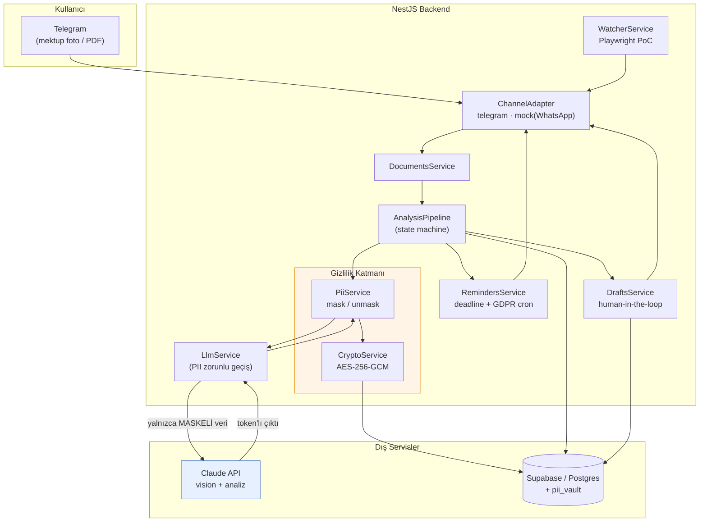
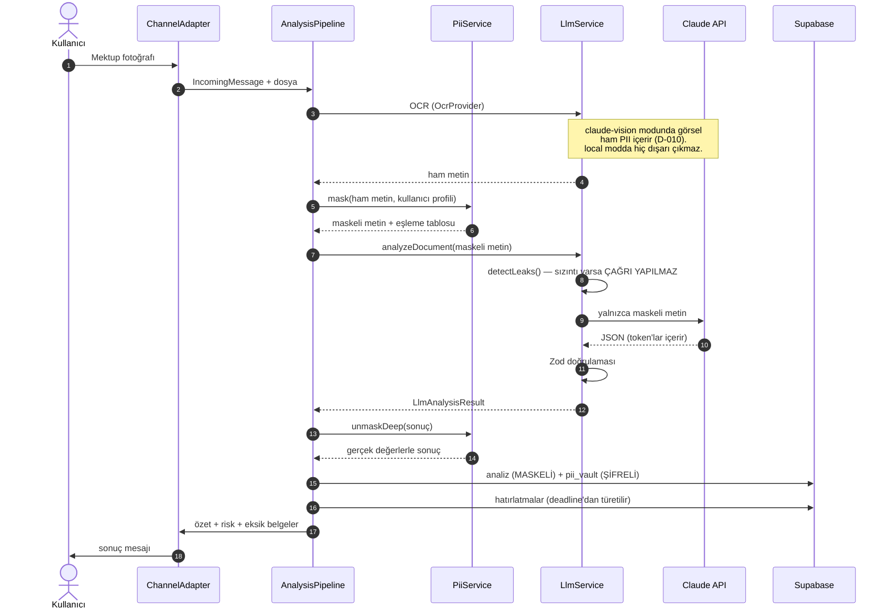
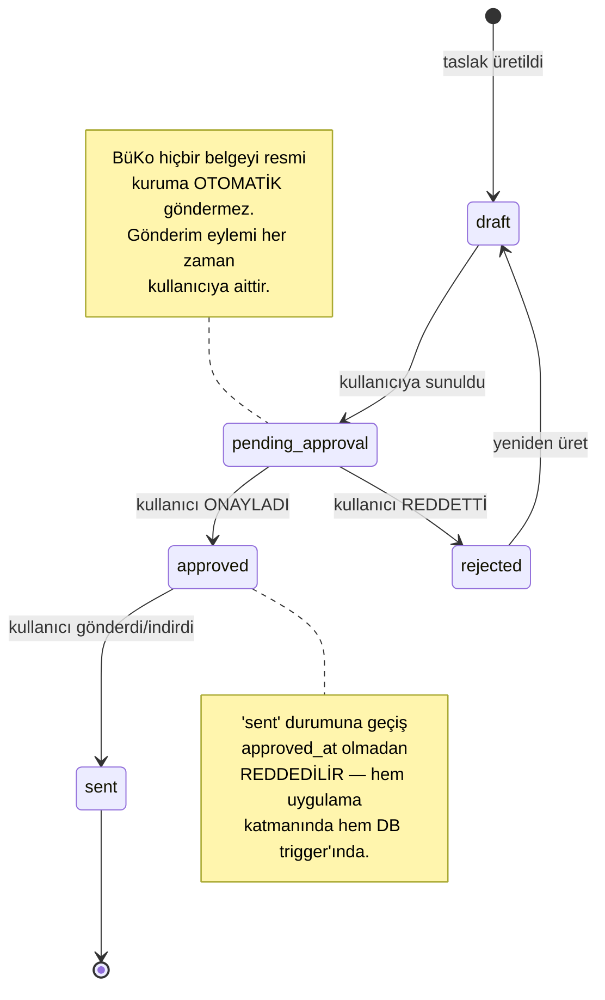
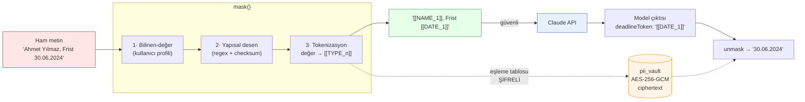
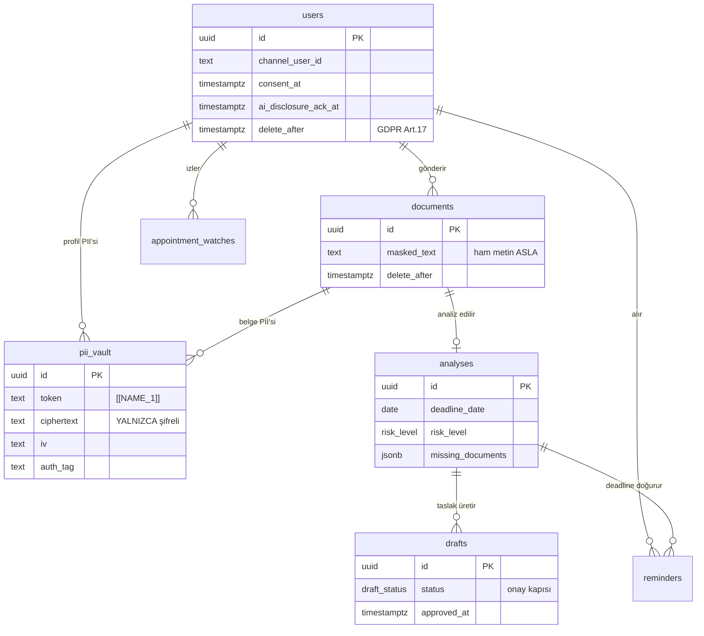

# BüKo — Mimari Diyagramlar

> Kaynak: `ARCHITECTURE.md`. Bu dosya görsel (mermaid) karşılıklarını içerir.
> GitHub bu diyagramları doğrudan render eder.

## 1. Sistem Bileşenleri

## 2. Belge Analiz Akışı (çekirdek döngü)

## 3. Human-in-the-Loop Onay Kapısı

## 4. PII Maskeleme Veri Akışı

## 5. Veri Modeli (ilişkiler)

